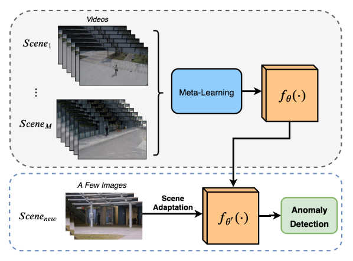

## Few-Shot Scene-Adaptive Anomaly Detection

본 논문은 2020년 ECCV 학회에서 발표되었으며, 영상 데이터셋에 대한 이상치 탐지 논문이다. 공식 코드는 [링크](https://github.com/yiweilu3/Few-shot-Scene-adaptive-Anomaly-Detection, "official link") 에 있으며, 본 저장소에서는 공식 소스를 기반으로 쉽게 활용될 수 있도록 구현한다. 

보통 이상치 탐지 Task 에서는 모든 이상 발생 상황에 대한 데이터셋을 확보할 수 없기 때문에 정상 데이터만을 가지고 학습한 후 추론시, 학습한 분포와 크게 차이나는 데이터를 이상이라고 정의한다. 이상치 탐지 Task 에 접근하는 방법은 크게 두 분류로 구분될 수 있다.

- Frame Reconstruction (Reconstruction-Based) 
정상 데이터를 훈련 데이터로 사용한다. 추론시, 이상 데이터를 학습중 보지 못한 데이터이므로 재구축 에러(Reconstruction Error) 가 크다. 재구축 에러는 PSNR, MSE 등을 사용하며 일정 임계값을 초과하면 이상 이라고 판별한다.

ex. Auto-Encoder (3D Conv AE, Conv LSTM AE)

- Future Frame Prediction (Prediction-Based) 
다음에 일어날 Scene 을 예측한다. 예측한 프레임과 실제 프레임간의 차이 (Y'-GT) 가 크면 이상 프레임 확률이 된다. 이는 이상치 탐지라고 정의하는 Task 본질에 더 자연스러운 접근 방법이다.

ex. GAN (UNET as Generator, CGAN as Discriminator)

하지만, 기존 이상치 탐지 접근 방향은 보지 못한 Scene 에 대해서 이상으로 판별하였기 때문에 다양한 Scene 에 대한 일반화 능력이 부족하다. 예를 들어 화학 공장에서 제조 공정 단계는 수백 가지이다. 각각의 제조 공정 영상은 다른 Scene 을 갖는다. 수백 가지의 개별 모델을 구축하는 것보다 한 개의 모델을 구축하여 적용할 수 있다면 개발 과정의 시간을 줄일 수 있을 것이다. 본 논문은 하나의 모델로 다양한 Scene 에 대해서 이상치 탐지를 할 수 있다는 점에서 흥미로웠다. 

본 논문에서 제안하는 학습 모델은 다음과 같다.

적은 데이터로부터 Fine Tunning 과정을 수행할 수 있도록 메타러닝 기법 중 하나인 MAML(Model Agnotic Meta Learning) 방법을 사용한다. MAML 기법은 Meta 모델을 학습 한 후, Fine Tunning 과정에서 적은 데이터 셋으로 모델을 다시 학습하는 기법이다. 본 논문에서 제안하는 모델 학습은 Meta Training 그리고 Meta Testing 로 나누어지며, Meta Training 과정에서 프리트레인 Future Frame Prediction 을 만든다.    

앞서 말한 Frame Reconstruction 기법과 Future Frame Prediction 기법 모두 적용할 수 있지만 본 논문에서는 Prediction 기법을 사용한다. 제안하는 모델은 r-GAN 이며 생성자로 U-net 을 사용하고, 판별자로 ConvLSTM 을 사용한다.  
1부터 m 개의 Scene 에 대해서 Meta Learning 모델을 학습한다.  

###### 출처 
[yiweilu3' s Few-shot-Scene-adaptive-Anomaly-Detection](https://github.com/yiweilu3/Few-shot-Scene-adaptive-Anomaly-Detection, "official link")

